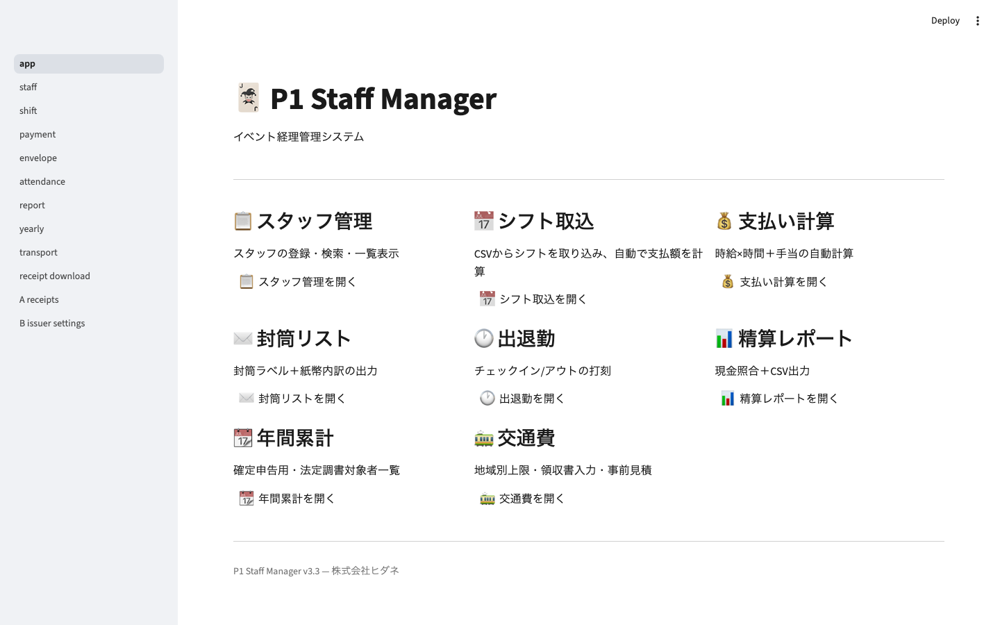
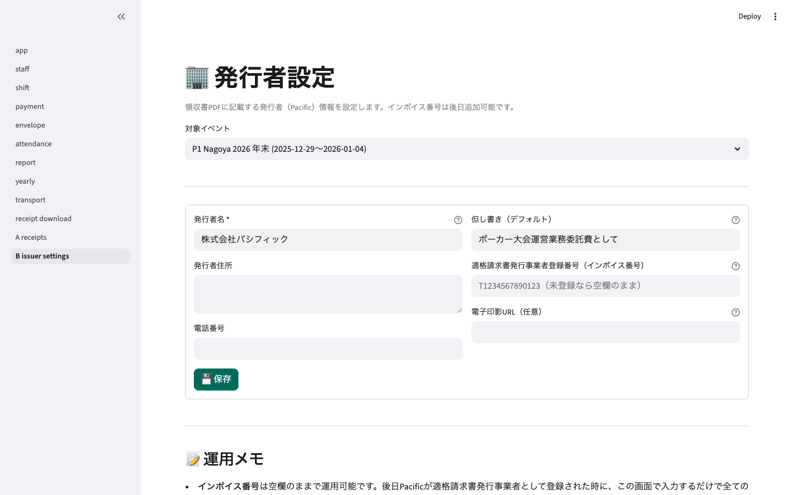
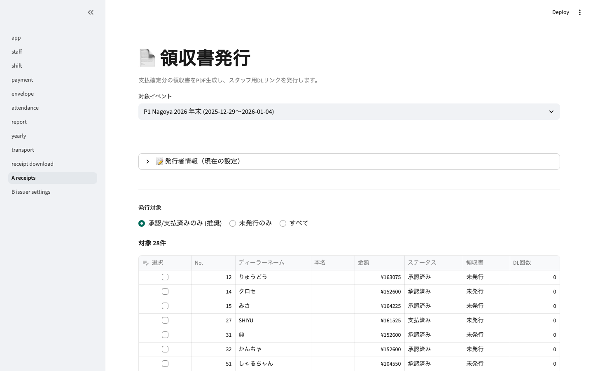
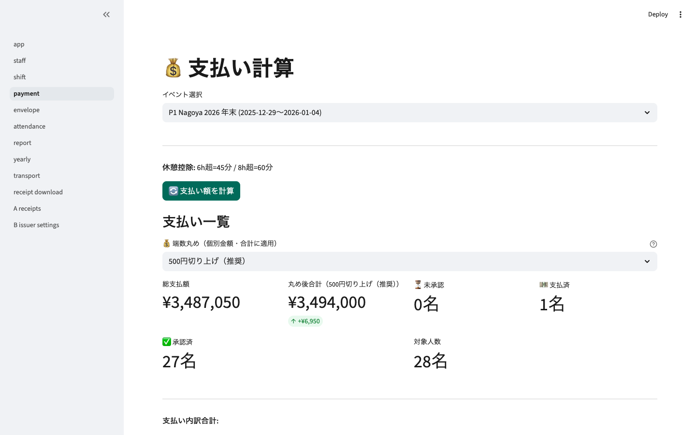
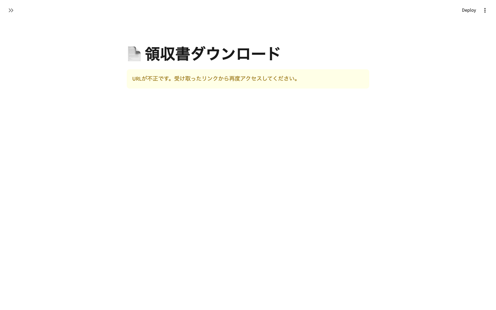
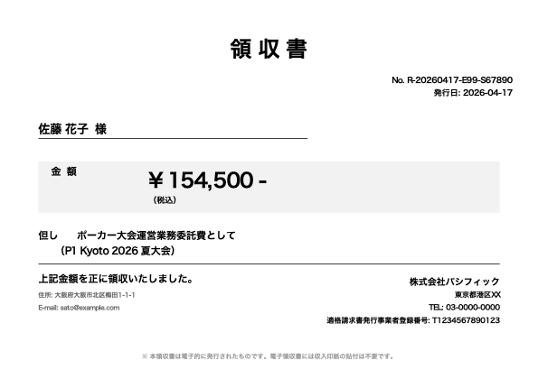

# 領収書デジタル発行機能 操作マニュアル

P1 Staff Manager v3.4（2026-04-17 追加機能）

---

## 📘 概要

Pacificがスタッフに代行発行する領収書を **PDF生成 → Supabase Storage保存 → 専用URL配布** まで自動化する機能。
スタッフは受け取ったURLを踏むだけでPDFダウンロードできます。

### 主な特徴
- ✅ **電子発行につき印紙不要**（PDFに注記自動付与）
- ✅ **インボイス番号は空欄運用可**（後日追加可能な設計）
- ✅ **トークン認証**で他人の領収書を見られない
- ✅ **有効期限付きURL**（デフォルト7日）
- ✅ **DL回数を記録**（受領確認代替）
- ✅ **一括生成**（承認/支払済み全員分まとめて）

---

## 🛠 初期セットアップ（初回のみ）

### ① Supabase SQLマイグレーション

Supabaseダッシュボード → **SQL Editor** を開く。以下を実行：

```sql
-- docs/db_migrations/20260417_add_receipt_columns.sql
-- p1_payments に領収書関連7列追加、p1_events に発行者情報6列追加
-- 詳細は同ファイル参照
```

### ② Supabase Storage バケット作成

Supabaseダッシュボード → **Storage** → **New bucket**

| 項目 | 値 |
|---|---|
| Name | `receipts` |
| Public | **OFF**（重要：Signed URL経由のみ） |
| File size limit | 5 MB |
| Allowed MIME types | `application/pdf` |

### ③ 発行者情報の入力
メニュー「B_issuer_settings（発行者設定）」で Pacific の情報を登録。

---

## 📄 操作フロー（毎大会の運用）

```
① 大会終了 → 既存機能で支払計算・承認
              ↓
② 「A_receipts（領収書発行）」で対象者を選び一括発行
              ↓
③ 発行されたDLリンクをCSVでエクスポート or 画面からコピー
              ↓
④ LINE/メール等でスタッフに各自のURLを送付
              ↓
⑤ スタッフがURLを開いてPDFダウンロード
```

---

## 📸 画面ガイド

### 1. ホーム画面

既存機能＋新規メニュー（receipt download / A receipts / B issuer settings）がサイドバーに追加されています。



### 2. 発行者設定（B_issuer_settings）

領収書PDFに印字する Pacific 情報を設定。インボイス番号は空欄でもOK（後日記入可）。



> ⚠️ 画面にエラー表示が出ている場合は **Supabase SQLマイグレーション未実行**です。初期セットアップ①を先に行ってください。

**入力項目**
| 項目 | 説明 | 必須 |
|---|---|---|
| 発行者名 | 例: 株式会社パシフィック | ✅ |
| 発行者住所 | - | 任意 |
| 電話番号 | - | 任意 |
| 但し書き（デフォルト） | 例: ポーカー大会運営業務委託費として | ✅ |
| インボイス番号 | T+13桁数字。**空欄なら領収書に表示しない** | 任意 |
| 電子印影URL | PNG推奨。Supabase Storageや外部URL | 任意 |

### 3. 領収書発行（A_receipts）

対象スタッフを選んで一括発行。既存領収書は強制再生成もできます。



**操作手順**
1. イベント選択
2. 「発行対象」を選ぶ（推奨：承認/支払済みのみ）
3. 対象スタッフの「選択」にチェック（表ヘッダーで全選択可）
4. 有効期限（デフォルト7日）を確認
5. **「選択分を一括発行」** ボタンをクリック
6. 数秒〜数十秒で発行完了（80名で約1〜2分目安）

**発行結果確認**
発行済みは画面下部の「🔗 発行済み領収書のDLリンク」に一覧表示。
「📥 DLリンク一覧をCSVでダウンロード」でCSV出力し、スタッフに各自のリンクを配布。

### 4. 支払い計算（既存・連携）
支払計算→承認済みのステータスが領収書発行の前提条件です。



### 5. スタッフ向けダウンロード画面（9_receipt_download）

スタッフはPacificから受け取ったURL（例: `https://p1-staff-manager.streamlit.app/receipt_download?token=xxxx`）を開くだけ。

**❌ トークン無し or 無効**


**✅ 正常時（イメージ）**
- 「領収書の準備ができました」の緑バナー
- 領収金額表示
- **「📥 PDFをダウンロード」** ボタン
- サイドバー非表示（管理メニューはスタッフに見えない）

---

## 📄 領収書PDFサンプル

### インボイス未登録時（現状 Pacific 想定）


- 発行日・領収書No.自動採番
- 宛名（本名）
- 金額（税込）
- 但し書き + 大会名
- 発行者情報 + 電話
- 「電子発行につき収入印紙不要」注記
- **インボイス番号欄は非表示**

### インボイス登録後（後日追加シナリオ）



Pacificが適格請求書発行事業者として登録されたら、発行者設定画面でインボイス番号を入力するだけで **全ての新規領収書に自動反映**されます。既存領収書は「強制再生成」で最新に更新可能。

---

## 🔐 セキュリティ

### トークン方式
- `secrets.token_urlsafe(32)` による256bitランダム値（UUID4より安全）
- 他人のURLを推測して領収書を見ることは事実上不可能
- 有効期限切れは自動的に無効化

### Storage非公開設定
- `receipts`バケットは **Public OFF**
- 直接URLでアクセスしても403
- Signed URLまたは内部トークン経由のみDL可能

### 監査ログ
- 発行日時・DL日時・DL回数をすべて記録
- audit_logに`issue_receipt`アクションが残る

---

## 🧪 テスト結果（自動E2E）

| テスト項目 | 結果 |
|---|---|
| トークン生成（衝突なし） | ✅ |
| 期限切れ判定 | ✅ |
| PDF生成（インボイスなし） | ✅ 3,318 bytes |
| PDF生成（インボイスあり） | ✅ 3,419 bytes |
| PDF生成（最小構成・住所/メール欠損時） | ✅ 3,102 bytes |
| 既存E2E（80名一連動作） | ✅ 24/24 PASS |

---

## ❓ FAQ

**Q: インボイスを後から追加したい**
→ 「B_issuer_settings」画面で登録番号を入力 → 保存。以降発行する領収書に自動反映。既存領収書を更新したい場合は「A_receipts」画面で **強制再生成** にチェックして一括再発行。

**Q: スタッフから「リンクが切れた」と連絡が来た**
→ 有効期限切れ。「A_receipts」画面で該当スタッフを再度選択して、**強制再生成** にチェックして再発行 → 新しいURLをスタッフに再送。

**Q: 印紙代はかかる？**
→ **不要です**。電子データで発行する領収書には収入印紙の貼付義務はありません（5万円以上でも同様）。PDFにもその旨を注記しています。

**Q: インボイスがないと発行できないスタッフがいる？**
→ 現状はインボイスなし運用でもPDFは正常に発行できます。インボイスが欲しいのは主に「スタッフ側が経費計上する」ケースですが、業務委託報酬の領収書は通常インボイス不要です。

**Q: 同じ領収書を複数回DLできる？**
→ 有効期限内なら何度でもDL可能。DL回数はカウントされ、管理画面で確認できます。

**Q: 領収書の内容を修正したい**
→ 「強制再生成」にチェックして発行し直すと新しいPDF・新しいトークンで上書きされます。

---

## 📁 ファイル構成（エンジニア向け）

### 新規追加ファイル
```
docs/db_migrations/20260417_add_receipt_columns.sql  ← DBスキーマ
utils/receipt_v2.py                                   ← PDF生成
utils/receipt_token.py                                ← トークン
utils/receipt_storage.py                              ← Supabase Storage
utils/receipt_db.py                                   ← DB CRUD
utils/receipt_issuer.py                               ← オーケストレーター
pages/9_receipt_download.py                           ← スタッフDL画面
pages/A_receipts.py                                   ← 管理者一括発行画面
pages/B_issuer_settings.py                            ← 発行者情報設定
test_e2e/4_receipt_unit_test.py                       ← ユニットテスト
test_e2e/5_capture_screenshots.py                     ← スクショ自動取得
```

### 既存ファイルへの変更
**なし**（全て新規ファイルとして追加。既存機能への影響ゼロ）

---

## 🔜 次の予定（Phase 2：契約書クラウド）

- PDF契約書テンプレート
- スタッフ専用署名画面（電子署名パッド）
- 署名完了ステータス追跡
- タイムスタンプ付与（改ざん防止）

Phase 1（領収書）の運用が落ち着いてから着手します。
